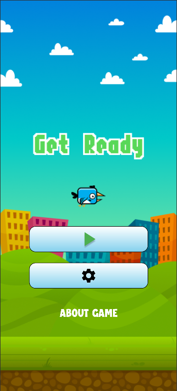
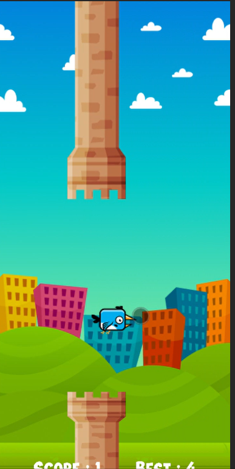
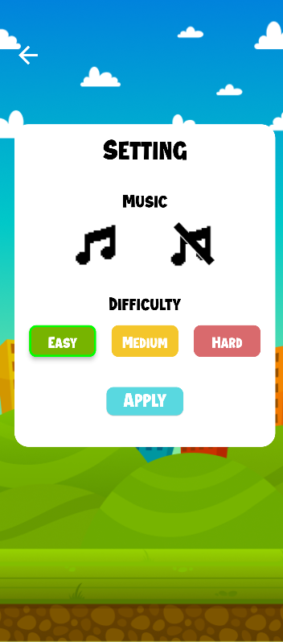

# 🐦 Tappy Bird Game - README.md

# Tappy Bird

A fun and addictive Flutter-based bird game where players control a bird and navigate through moving towers. The objective is simple: keep the bird flying and pass through as many towers as possible without colliding with them. The game offers multiple difficulty levels, engaging animations, sound controls, Firebase integration, and a polished user experience.

## 📱 Play Store

Download the game from Google Play Store:

**Tappy Bird**
[Google Play Store - Tappy Bird](https://play.google.com/store/apps/details?id=com.ext.tappybird&pcampaignid=web_share&utm_source=chatgpt.com)

---

## 🎮 Game Overview

Tappy Bird is an arcade-style game where players tap the screen to make the bird fly upward while avoiding obstacles. The game becomes more challenging as the speed increases based on the selected difficulty level.

### Objective

* Control the bird using screen taps.
* Pass through the gaps between towers.
* Avoid colliding with towers.
* Achieve the highest possible score.

---

## ✨ Features

### 🐦 Gameplay

* Simple tap-to-fly mechanics.
* Endless gameplay experience.
* Real-time score tracking.
* Smooth and responsive controls.

### 🎯 Multiple Difficulty Levels

The game includes three difficulty modes:

| Difficulty | Description                         |
| ---------- | ----------------------------------- |
| Easy       | Slow tower movement for beginners   |
| Medium     | Balanced gameplay experience        |
| Hard       | Fast-paced and challenging gameplay |

Difficulty directly affects obstacle movement speed and game challenge.

---

### ⚙️ Settings Module

Players can customize their experience through the Settings screen.

#### Available Settings

* 🔊 Background Music On/Off
* 🎵 Sound Effects (SFX) On/Off
* 🎚️ Difficulty Selection

  * Easy
  * Medium
  * Hard

All user preferences are saved using Firebase.

---

### 🎬 Splash Screen

* Attractive video-based splash screen.
* Smooth transitions and loading animations.
* Modern UI design.

---

### 🎨 Beautiful User Interface

* Modern game design.
* Smooth animations.
* Responsive layouts.
* Engaging visual effects.

---

### 🏆 Win & Lose Screens

#### Win Screen

* Score display.
* Success animations.
* Play Again option.

#### Lose Screen

* Final score display.
* Retry functionality.
* Smooth transition effects.

---

### 👤 Guest Login

The game supports Firebase Anonymous Authentication:

* Quick access without registration.
* No email or password required.
* Instant gameplay experience.
* Secure user management through Firebase.

---

### ⭐ User Rating System

Players can rate their gaming experience.

Features:

* User feedback collection.
* Rating storage using Firebase.
* Helps improve future updates.

---

## 🔥 Firebase Integration

The project uses Firebase services for backend functionality.

### Firebase Services Used

* Firebase Authentication (Guest Login)
* Cloud Firestore
* Firebase Analytics
* Firebase Storage
* Firebase Crashlytics

### Firebase Features

* User Authentication
* Game Data Storage
* User Settings Management
* Rating Management
* Analytics Tracking

---

## 🚀 Play Store Deployment

The application has been successfully published on the Google Play Store.

### Deployment Highlights

* Production-ready release build.
* Optimized performance.
* Firebase-integrated backend.
* User-friendly experience.

---

## 🛠️ Technologies Used

### Frontend

* Flutter
* Dart

### Backend

* Firebase Authentication
* Cloud Firestore
* Firebase Storage

### Tools

* Android Studio
* Git & GitHub
## 📸 Screenshots

  
  
  

## 🎯 Future Enhancements

* Global Leaderboard
* Achievement System
* Multiple Bird Characters
* Daily Rewards
* Multiplayer Challenges
* Cloud Save Support

---

### Project Highlights

✅ Flutter Game Development
✅ Firebase Integration
✅ Guest Authentication
✅ Difficulty Levels
✅ Audio & Music Controls
✅ Play Store Deployment
✅ Attractive Animations & UI
✅ Rating System

---
### 🎮 Keep Tapping, Keep Flying, and Beat Your High Score! 🐦🏆